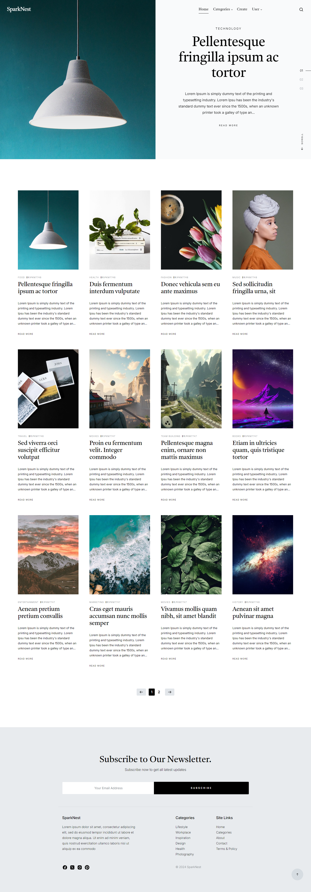

# SparkNest V2.5

A **Distinctive** and **stylish** Web application for article sharing based on **PERN** Stack. Developed with the use of **React in FrontEnd** and **Node.js, ExpressJs and PostgreSQL in BackEnd**.

## Deployment

Deployed Website (V 2.5): [https://sparknest.run.place/](https://sparknest.run.place/)
Deployed on AWS.

## Features
Using this website a **user** can :

  * Login, Signup, Google Login/Signup.
  * Reset forgot password using email.
  * Edit, Update, Delete user profile.
  * Create, Edit, Update, Delete created article.
  * Add, Reply, Delete comments.
  * Save and Like articles -> shown in profile section.
  * Contact and send message to SparkNest team.
  * View other user profile using user id

Create, Read, Update and Delete on user, articles and comments are performed on user's authorized space only.

## Technologies used

  * **React JS**, CSS, **Bootstrap V5.3**
  * **Javascript**, **Quill**
  * **Express.js**, **Nodejs, npm**
  * REST APIs: **GET**, **POST**, **PATCH**, **DELETE**
  * **PostgresSQL RDBMS**
  * **Login/LogOut & Register** using **express-session**
  * **Password hashing** using **bcrypt**
  * **Local and Google strategy** for **Login** and **Sign Up**
  * **Session and Cookie** using **Passport**
  * **Mailing and Password-reset** using **Nodemailer**

## Authors

  - **Prabhat Kumar Mishra**
    [pkm774](https://pkm774.github.io/)

## Licence
[LICENCE](./LICENSE.md)